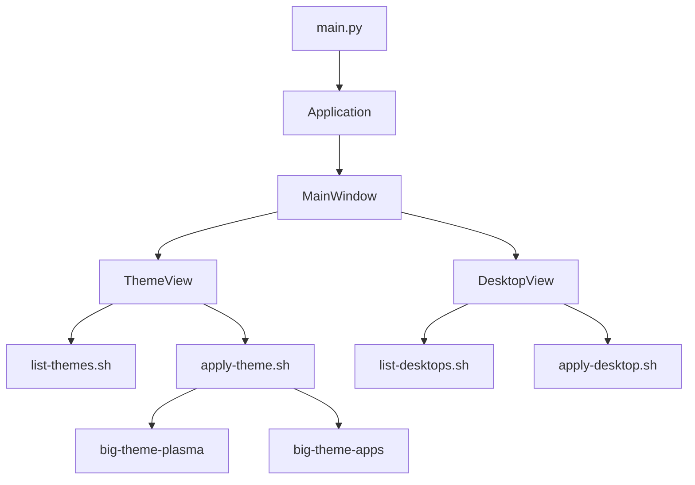

<div align="center">

# 🎨 BigLinux Themes GUI

**Visual Theme & Desktop Configuration Manager for BigLinux**

[](LICENSE)
[](https://gtk.org/)
[](https://python.org/)
[](https://www.biglinux.com.br/)

</div>

---

## 📖 Table of Contents

- [Overview](#-overview)
- [Features](#-features)
- [Project Structure](#-project-structure)
- [Architecture](#-architecture)
- [Development](#-development)
- [Contributing](#-contributing)
- [License](#-license)

---

## 📋 Overview

**BigLinux Themes GUI** is a modern GTK4 + Libadwaita application that provides an intuitive graphical interface for managing desktop themes and layouts in BigLinux. It works on both the LiveCD (initial setup) and installed systems.

---

## 🚀 Features

- 🎨 **Theme Selection** — Dark/Light modes with color scheme variants
- 🖥️ **Desktop Layouts** — Pre-configured panel positions and behaviors
- 🖼️ **Live Preview** — Real-time theme preview before applying
- 🔄 **Apply System-wide** — Updates Plasma, GTK, and Qt applications
- 🌐 **Internationalization** — Full translation support via gettext

---

## 📁 Project Structure

```tree
biglinux-themes-gui/
├── pkgbuild/                 # Arch Linux packaging files
├── locale/                   # Translations
└── usr/share/biglinux/biglinux-themes-gui/
    ├── main.py               # Application entry point
    ├── application.py        # GTK Application class
    ├── window.py             # Main window implementation
    ├── theme_view.py         # Theme selection view
    ├── desktop_view.py       # Desktop layout view
    ├── list-desktops.sh      # Desktop preset discovery
    ├── list-themes.sh        # Theme discovery
    ├── apply-desktop.sh      # Apply desktop layout
    └── apply-theme.sh        # Apply visual theme
```

---

## 🏗️ Architecture

### Component Diagram



### Integration Points

| Component | Purpose |
|-----------|---------|
| `big-theme-plasma` | Applies KDE Plasma themes |
| `big-theme-apps` | Applies GTK/Qt application themes |
| LiveCD services.py | Launches this GUI during live setup |

---

## 🛠️ Development

### Building the Package

```bash
cd pkgbuild
makepkg -si
```

### Running Locally

```bash
cd usr/share/biglinux/biglinux-themes-gui
python3 main.py
```

### Testing with GTK4 Broadway (Web Preview)

```bash
# Terminal 1: Start Broadway daemon
gtk4-broadwayd :5 &

# Terminal 2: Run application
GDK_BACKEND=broadway BROADWAY_DISPLAY=:5 python3 main.py

# Access in browser: http://127.0.0.1:8085
```

### Dependencies
- `python`, `python-gobject`
- `gtk4`, `libadwaita`
- `plasma-workspace`, `kvantum`

---

## 🤝 Contributing

Contributions are welcome! Please follow these steps:

1. Fork the repository.
2. Create a feature branch (`git checkout -b feature/amazing-feature`).
3. Commit your changes (`git commit -m 'Add amazing feature'`).
4. Push to the branch (`git push origin feature/amazing-feature`).
5. Open a Pull Request.

---

## 📄 License

Distributed under the **GPL-3.0 License**. See [LICENSE](LICENSE) for more information.

---

<div align="center">

**Made with 💚 by the BigLinux Team**

[Website](https://www.biglinux.com.br)

</div>
